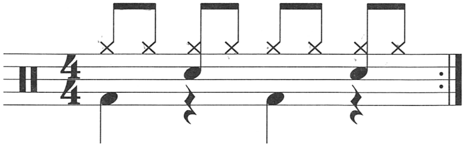
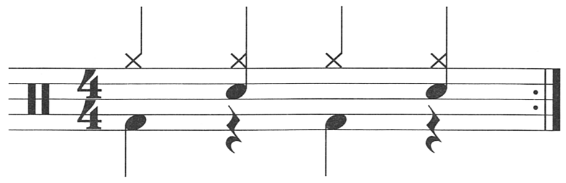

## Description

Your most basic rock beat.

## Beat

### 1/8 notes

### 1/4 notes

### Song Examples

#### 1/8 notes

1. [Avenged Sevenfold - Hail to the King](https://www.youtube.com/watch?v=DelhLppPSxY)
2. [Megadeth - Symphony of Destruction](https://www.youtube.com/watch?v=K5jvUXij7nU)
3. [Led Zeplin - Kasmir](https://www.youtube.com/watch?v=sfR_HWMzgyc)
4. [Madonna - Like a Virgin](https://www.youtube.com/watch?v=s__rX_WL100)

#### 1/4 notes

1. [Motley Crue - Looks that Kill](https://www.youtube.com/watch?v=9wPHxQMgdKs)