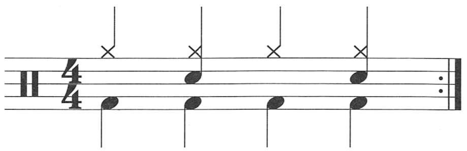

## Description

Also known as a basic disco beat.

## Beat

### 1/8 notes

### 1/4 notes

### Song Examples

#### 1/8 notes

1. [Bee Gees - Stayin' Alive](https://www.youtube.com/watch?v=fNFzfwLM72c)
2. [Kool & The Gang - Celebration](https://www.youtube.com/watch?v=3GwjfUFyY6M)
3. [Van Halen - Panama](https://www.youtube.com/watch?v=fuKDBPw8wQA)

#### 1/4 notes

1. TBD...

### Additional Stuffs

[Static-X - Push it](https://www.youtube.com/watch?v=Ps0MfBG5-Uo) is a song where the cymbals are doing a 1/16 note version of the disco beat.